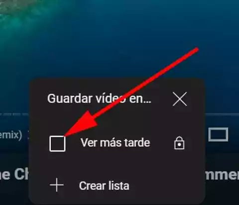
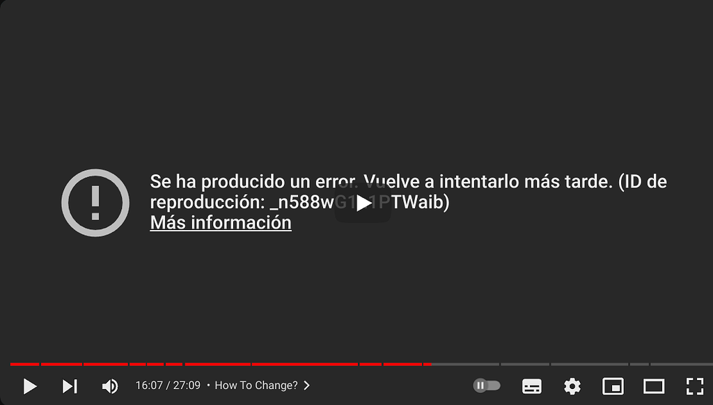

# Módulo 0 - UX Laboratorio

> App elegida: Youtube APP

| Heurística                                  | Nota (1-10) |
| ------------------------------------------- | ----------- |
| Visibilidad del estado del sistema          | 9           |
| Concordancia con el mundo real              | 10          |
| Control y libertad del usuario              | 8           |
| Consistencia y estándares                   | 9           |
| Prevención de errores                       | 7           |
| Reconocer en lugar de recordar              | 9           |
| Flexibilidad y eficiencia de uso            | 8           |
| Estética y diseño minimalista               | 7           |
| Ayudar a reconocer y recuperarse de errores | 6           |
| Ayuda y documentación                       | 5           |

## 1. Visibilidad del estado del sistema

> Retroalimentación al usuario
>
> Nota 9

YouTube suele ser excelente en **mantener a los usuarios informados**. Por ejemplo, hay claras señales de carga **(spinners)** cuando un video está procesando, y se indican los estados de pausa, reproducción o carga. Sin embargo, en algunos casos, los tiempos de carga de contenido pueden no estar bien indicados (ej. lista de videos en la página principal tarda en cargar sin retroalimentación).

### Ejemplo Skeleton

### Ejemplo Loading

## 2. Concordancia entre el sistema y el mundo real

> Uso de términos y conceptos familiares
>
> Nota 10

YouTube usa un **lenguaje claro y familiar**. Términos como _"Suscribirse"_, _"Me gusta", "No me gusta"_ y _"Reproducción automática"_ son fácilmente **comprensibles** para cualquier usuario. Las acciones de _"compartir"_ y _"guardar en listas de reproducción"_ son también conceptos que coinciden con las expectativas del mundo real.

### Ejemplo lenguaje popularizado y comprensible

## 3. Control y libertad del usuario

> Deshacer y rehacer acciones
>
> Nota 8

En YouTube, los usuarios pueden fácilmente regresar a la pantalla anterior, cerrar ventanas emergentes, cancelar la reproducción de videos, etc. Sin embargo, algunas acciones como cambiar una playlist o eliminar contenido de listas no tienen confirmación o la opción de deshacer de manera intuitiva, lo cual podría mejorar.

### Ejemplo user friendly

## 4. Consistencia y estándares

> Patrones de diseño coherentes
>
> Nota 9

YouTube sigue estándares consistentes en cuanto a navegación y estilo de botones. Sin embargo, algunos usuarios pueden encontrar cierta inconsistencia en la ubicación de ciertas funciones (por ejemplo, los controles de listas de reproducción y los botones de compartir que varían según la vista móvil o de escritorio).

### Ejemplo Navegacion

## 5. Prevención de errores

> Evitar que ocurran errores
>
> Nota 7

YouTube hace un buen trabajo previniendo errores críticos. No obstante, en términos de contenido subido, si un usuario accidentalmente sube el archivo equivocado, no hay un proceso preventivo muy claro antes de que el contenido ya esté público. Algunas veces la app permite reproducir videos de baja calidad sin avisos claros o sin prevenir posibles problemas técnicos.

## 6. Reconocer en lugar de recordar

> Minimizar la carga de memoria del usuario
>
> Nota 9

La interfaz de YouTube es muy visual y no requiere que los usuarios recuerden mucha información. Funciones como el historial de reproducciones, listas de "Ver más tarde" y recomendaciones personalizadas facilitan la navegación sin depender de la memoria del usuario.

### Ejemplo ver mas tarde

## 7. Flexibilidad y eficiencia de uso

> Atajos y funciones avanzadas
>
> Nota 8

YouTube ofrece atajos de teclado que mejoran la eficiencia (ej. barra espaciadora para pausar, "F" para pantalla completa, etc.), lo cual es excelente para usuarios avanzados. Sin embargo, algunos usuarios podrían no estar al tanto de estos atajos, ya que no están muy promocionados en la interfaz.

### Ejemplo atajos de teclado

## 8. Estética y diseño minimalista

> Diseño simple y sin sobrecarga de información
>
> Nota 7

YouTube tiene un diseño relativamente limpio, pero a veces la página principal puede parecer sobrecargada con sugerencias, anuncios y múltiples opciones de contenido. El diseño podría beneficiarse de una presentación más enfocada y menos intrusiva, sobre todo cuando hay múltiples recomendaciones de videos.

### Ejemplo atajos de teclado

## 9. Ayudar a reconocer, diagnosticar y recuperarse de errores

> Mensajes de error claros
>
> Nota 6

Los mensajes de error en YouTube a veces son vagos. Por ejemplo, cuando un video no está disponible o hay un problema con la conexión, los mensajes no siempre ofrecen soluciones concretas para el usuario. Podrían mejorar en cuanto a claridad y opciones de recuperación.

### Ejemplo error con poca información

## 10. Ayuda y documentación

> Soporte disponible cuando es necesario
>
> Nota 5

Aunque YouTube tiene una sección de ayuda, no es particularmente visible ni accesible desde la interfaz principal. Además, encontrar documentación para resolver problemas avanzados puede ser confuso. La mayoría de los usuarios terminan buscando soluciones en Google o foros.
