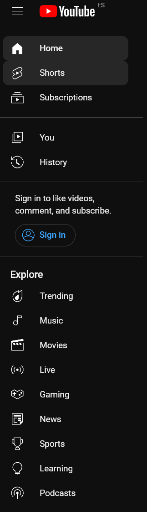
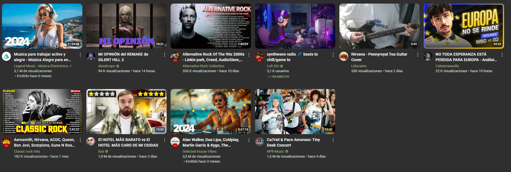
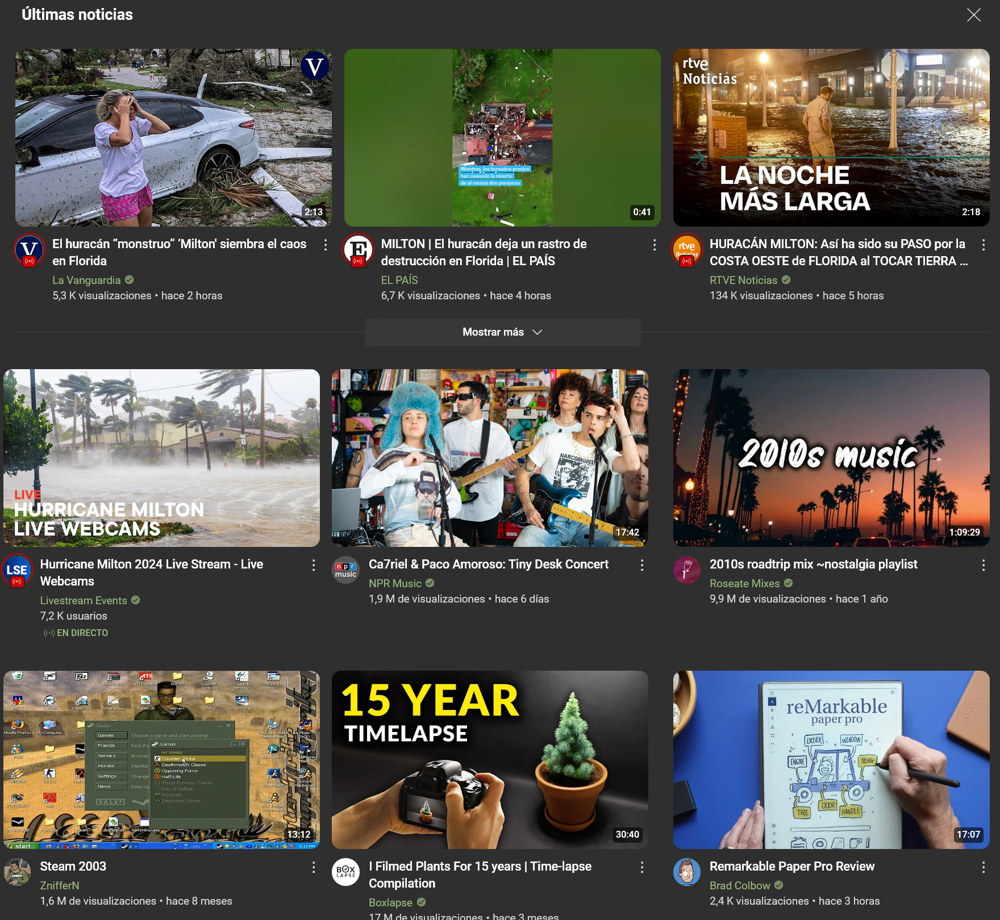
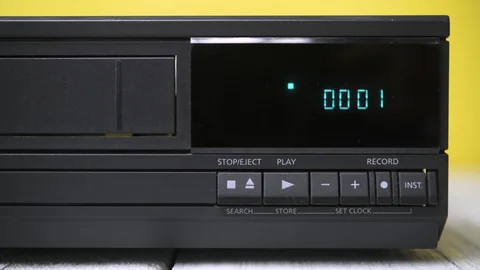
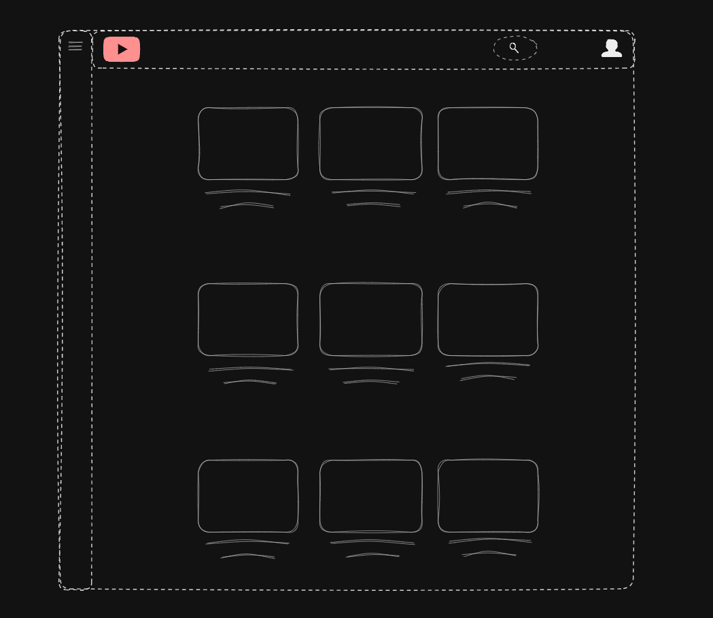
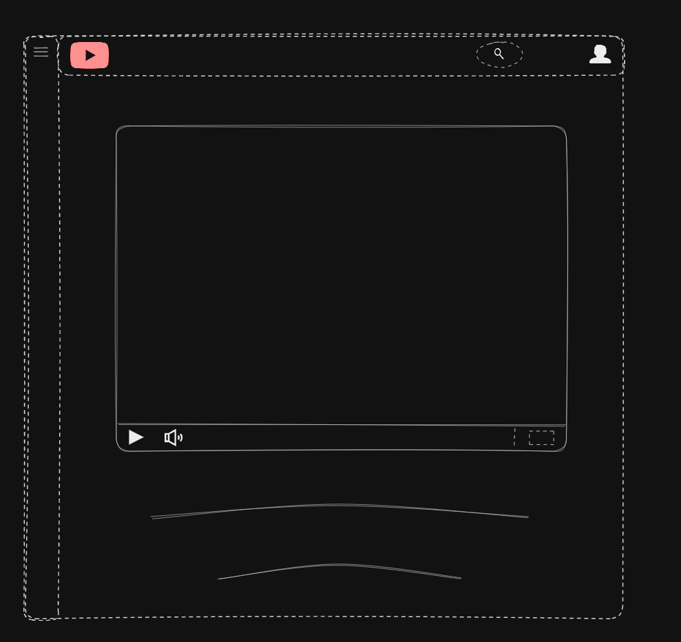

# Evaluación de la Interfaz Web de YouTube Basada en las Leyes de la Gestalt

Este documento describe cómo la interfaz web de YouTube cumple con las **Leyes de la Gestalt**. Estas leyes proporcionan principios que explican cómo los usuarios perciben la información visual y cómo organizan los elementos en función de su proximidad, similitud, continuidad, entre otros.

## 1. Ley de Proximidad

### Descripción

Los elementos que están cercanos entre sí se perciben como parte de un mismo grupo.

### Ejemplo en YouTube

En la página principal de YouTube, los videos recomendados están agrupados en filas o secciones cercanas, lo que sugiere que están asociados temáticamente. Los videos relacionados se colocan juntos, lo que hace que el usuario los perciba como parte de una misma categoría o tema.

---

> 
>
> Ejemplo recomendados debajo del video que se esta reproduccioendo con filtros de la misma categoria.

## 2. Ley de Similitud

### Descripción

Los elementos que comparten características visuales similares (como color, forma o tamaño) son percibidos como parte de un mismo grupo.

### Ejemplo en YouTube

Los íconos de los videos, botones como "Me gusta" y "No me gusta", y los controles de reproducción tienen diseños coherentes en toda la interfaz. Esta similitud facilita que los usuarios identifiquen rápidamente los elementos funcionales del sistema y los asocien con las mismas acciones, mejorando la experiencia de navegación.

---

> 
>
> Ejemplo similitud entre botones.

## 3. Ley de Continuidad

### Descripción

Los elementos dispuestos de forma continua o alineados se perciben como parte de un patrón o flujo visual.

### Ejemplo en YouTube

La barra lateral de navegación de YouTube, que incluye secciones como "Inicio", "Tendencias" y "Suscripciones", está dispuesta verticalmente y permite un desplazamiento fluido. Esto guía a los usuarios de manera intuitiva sin crear interrupciones, haciendo que el recorrido visual sea más natural y predecible.

---

> 
>
> Ejemplo continuidad en el sidebar.

## 4. Ley de Figura y Fondo

### Descripción

Esta ley establece que nuestra percepción tiende a diferenciar un objeto principal (figura) del fondo sobre el cual se sitúa.

### Ejemplo en YouTube

Las miniaturas de los videos se destacan sobre un fondo claro, lo que facilita que el usuario se enfoque en el contenido principal. Además, cuando se reproduce un video, la interfaz pasa a un modo oscuro (modo cine), lo que da mayor protagonismo al video y minimiza las distracciones del fondo.

---

> 
>
> Ejemplo miniaturas en el modo oscuro.

## 5. Ley de Cierre

### Descripción

El cerebro humano tiende a completar formas incompletas o fragmentadas, percibiéndolas como un todo.

### Ejemplo en YouTube

Aunque algunas miniaturas de video y títulos de los videos se muestran recortados en la vista previa, el usuario puede percibir la totalidad del contenido gracias a esta tendencia a completar la información faltante. YouTube aprovecha esta ley para que los usuarios comprendan rápidamente el contenido sin sobrecargar la pantalla.

---

> 
>
> Ejemplo card con toda la informacion del video.

## 6. Ley de Simetría

### Descripción

Los elementos simétricos son percibidos como parte de un grupo equilibrado y armonioso.

### Ejemplo en YouTube

En la página principal de YouTube, los videos están organizados en una cuadrícula simétrica. Cada fila contiene miniaturas de videos del mismo tamaño y con una distribución balanceada, lo que aporta una sensación de orden visual y ayuda al usuario a explorar el contenido sin confusión.

---

> 
>
> Ejemplo card con toda la informacion del video.

## 7. Ley de la Buena Forma (Prägnanz)

### Descripción

El principio de buena forma establece que los usuarios tienden a percibir las formas más simples y regulares como las más comprensibles y estables.

### Ejemplo en YouTube

YouTube utiliza íconos y botones de formas simples y reconocibles, como el botón de reproducción ("play") o los botones de "me gusta". Estos elementos geométricos son fáciles de identificar y permiten que los usuarios naveguen de forma rápida y eficiente por la plataforma.

---

> 
>
> Ejemplo similitud botones de youtube con los de los vhs antiguos.

## Prototipo a bajo nivel

[Enlace al prototipo a bajo nivel](https://excalidraw.com/#json=3wu6uiHNNQaM4gsFirStl,-GRfMka08aoc7VIwOrlgCA)

