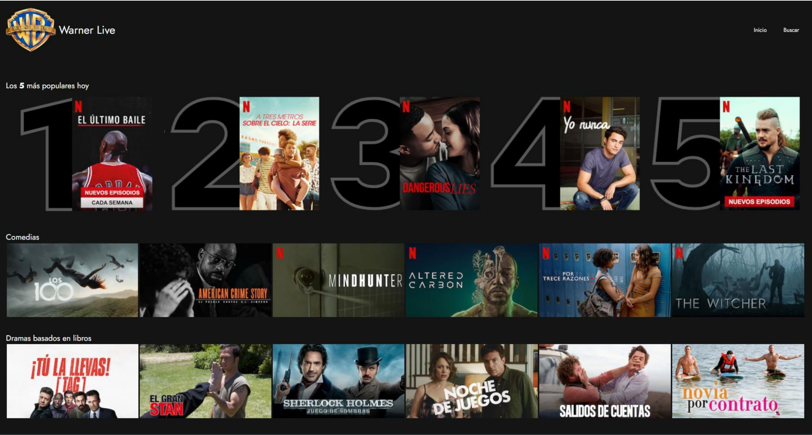
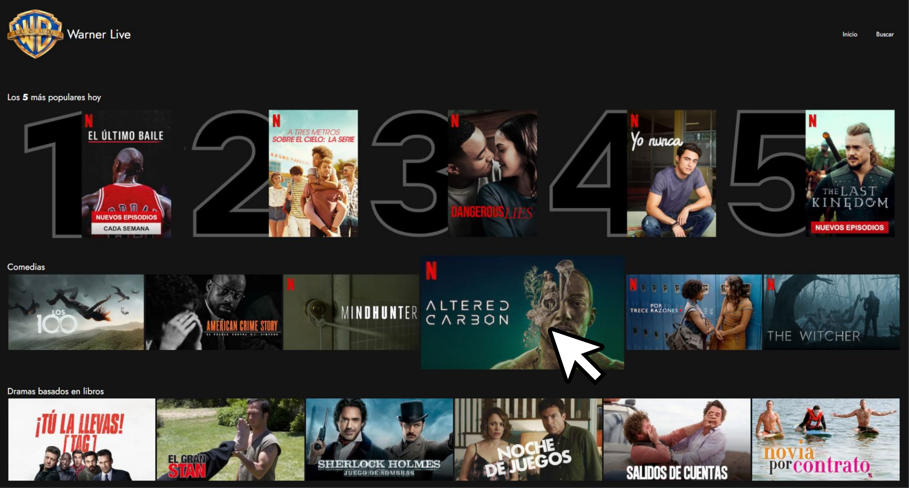
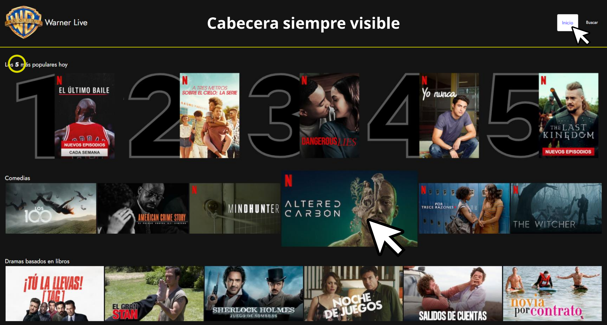
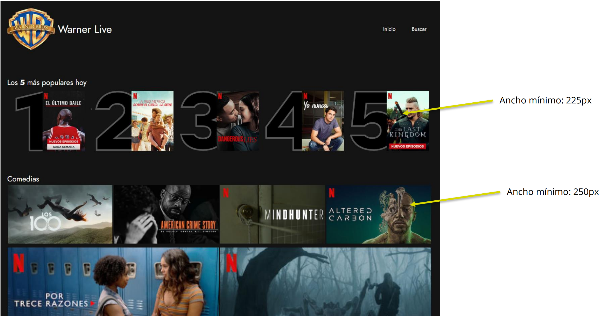
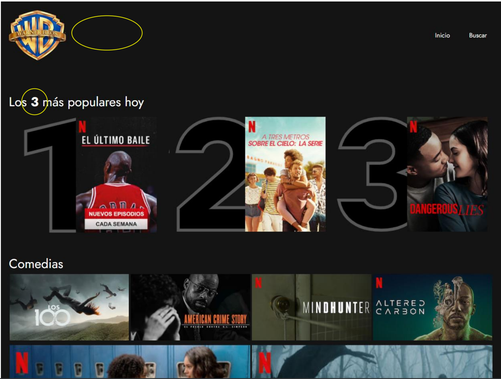
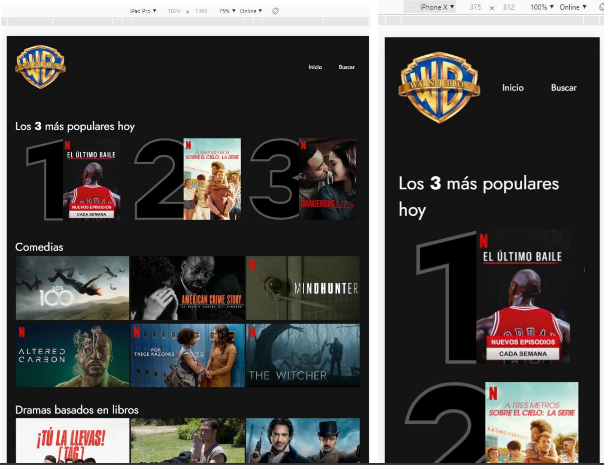

# Layout

> Reto del módulo

## Introducción

Una conocida casa cinematográfica quiere crear su propia plataforma on-line
para servir sus producciones, a la que van a llamar **WARNER LIVE**.

Nos han solicitado una prueba de maquetación de un primer diseño,
del resultado de la prueba dependerá pasar a la siguiente fase de selección.

🚀

### Diseño Desktop (ancho 1280px mínimo)

### Diseño Desktop (ancho 1280px mínimo)

### Diseño Desktop (ancho 1280px mínimo)

### Diseño Responsive

### Diseño Mobile/Tablet (hasta 1280px)

### Diseño Mobile/Tablet (hasta 1280px)

## Notas

- Fuente utilizada: Jost
  (https://fonts.google.com/specimen/Jost?preview.text=warner+live&preview.text_type=custom)
- Color de fondo de la plataforma: #141414
- Se adjunta carpeta de trabajo con la base de HTML (puede ser modificado al gusto) y las imágenes, carátulas
  y logo, que se pueden modificar/añadir.
- Se aporta los requisitos de diseño base, con libertad de creatividad.
