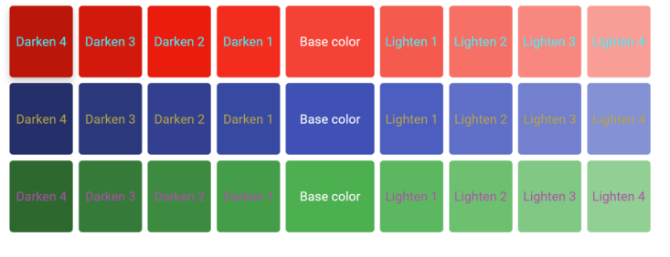
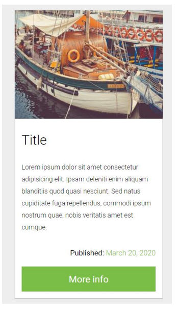

# Laboratorio Módulo Layout

## Ejercicio 1: Crear una paleta de colores dinámica.

#### Usar el lenguaje Sass para crear distintos temas de paletas de colores.

#### La idea es partir de un color base, y a partir de ese color generar 4 colores más oscuros de manera gradual, y cuatro colores más claros de manera gradual.

#### Para comprobar que todo está funcionando como se espera utilizar el siguiente html:

```html
<div class="container-1">
  <div class="box darken-4"><span class="color-box-text">Darken 4 </span></div>
  <div class="box darken-3"><span class="color-box-text">Darken 3 </span></div>
  <div class="box darken-2"><span class="color-box-text">Darken 2 </span></div>
  <div class="box darken-1"><span class="color-box-text">Darken 1 </span></div>
  <div class="box base-color">
    <span class="color-box-text">Base color</span>
  </div>
  <div class="box lighten-1">
    <span class="color-box-text">Lighten 1 </span>
  </div>
  <div class="box lighten-2">
    <span class="color-box-text">Lighten 2 </span>
  </div>
  <div class="box lighten-3">
    <span class="color-box-text">Lighten 3 </span>
  </div>
  <div class="box lighten-4">
    <span class="color-box-text">Lighten 4 </span>
  </div>
</div>
```

#### NOTA: Para este ejercicio se puede utilizar cualquier estructura de Sass que se considere necesaria. El html para mostrar resultados deberá será modificado

#### con clases.

#### Resultado esperado:



## Ejercicio 2: Crear dos temas distintos y mostrar los resultados en una página.

#### Los cambios en el tema afectan a las siguientes características:

- Color
- Fuente
- Border Radius
- Shadow Box

#### Para visualizar los cambios debería ser suficiente importar un tema u otro en el fichero de estilos principal.

#### Resultado tema A:


#### Resultado tema B:


## Ejercicio 3 : Crear la barra de navegación de la imagen usando Flexbox.

#### El html es abierto completamente, es decir crear las estructuras necesarias que se crean convenientes.

### La barra de navegación responde a distintas resoluciones. Utilizar media queries para conseguir este resultado.

## Resultado resoluciones mayores:


### Resultado resoluciones menores:


## Ejercicio 4: Crearemos un elemento de tipo card con Grid CSS.

#### Las alineaciones deberán hacerse con esta característica, pero el html es totalmente abierto.


