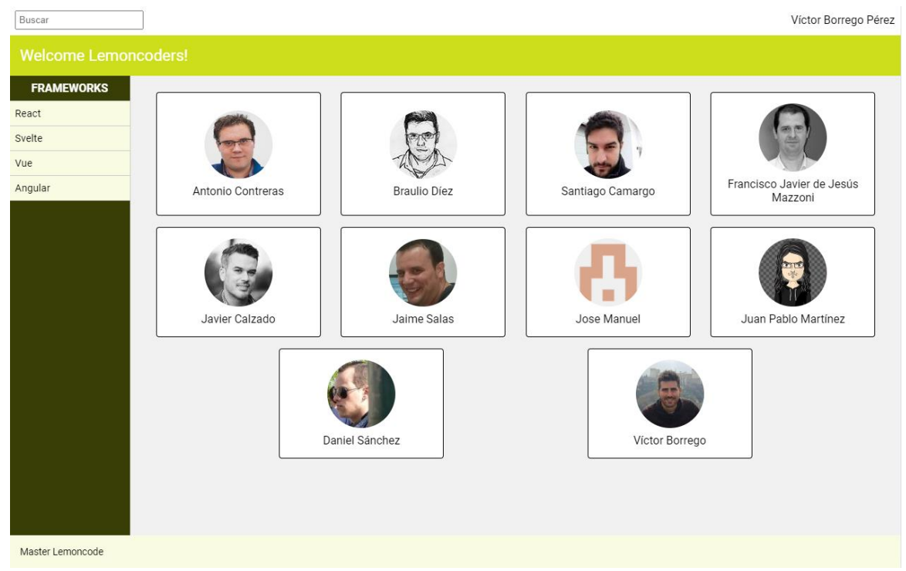
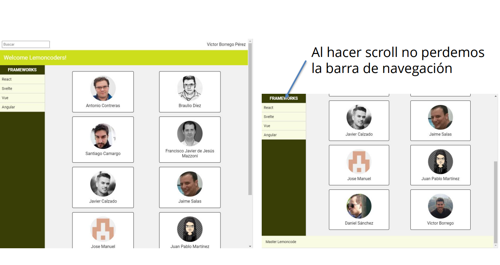
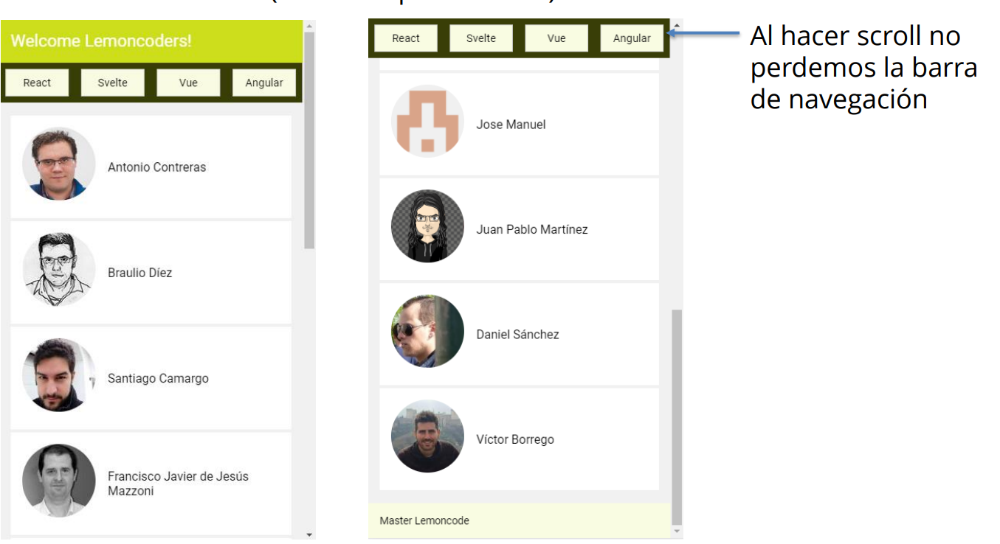
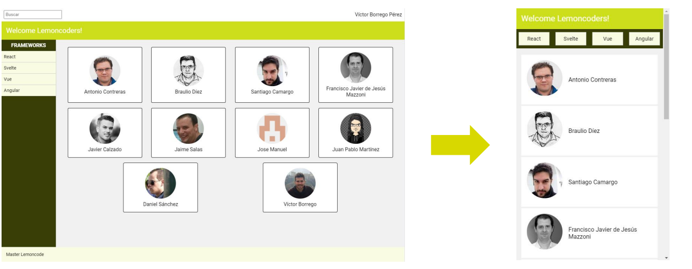

# Layout

## Laboratorio Extra

## Introducción

```
Vamos a crear un Layoutpara una aplicación, que contendrá:
```

- Header:
  - Toolbarconun input de textoparabúsquedas y nombre del
    usuario logado.
  - Barracon el nombre de la aplicación.
- Nav:
  - Menú con varias opciones de navegación
- Main:
  - Contenido con la información principal de la aplicación.
  - Fondo diferente de blanco.
- Footer:
  - Texto de la compañía, al final de la página (aunque el
    contenido no ocupe todo el alto)

Diseño Desktop (a partir de 768px)





Al hacer scrollno perdemos
la barra de navegación

Diseño Mobile/Tablet (hasta 768px de ancho)



```
Al hacer scrollno
perdemos la barra
de navegación
```

Consideraciones

- No perder en ninguna resolución la barra de navegación al hacer scroll.
- En resolucionespequeñas (hasta 768px de ancho):
  - Contenido a ocultar:
    - Barra superior con input de búsqueda y nombre de usuario
    - Título del menú
  - Cambiar menú a la parte superior, bajo el header.
  - Cambiarlaorganizacióndelcontenido principal paravisualizarlosinproblemas - Libertaddediseñoycreatividad: - Tema - Contenido - Breakpoints - Colores - Etc...


